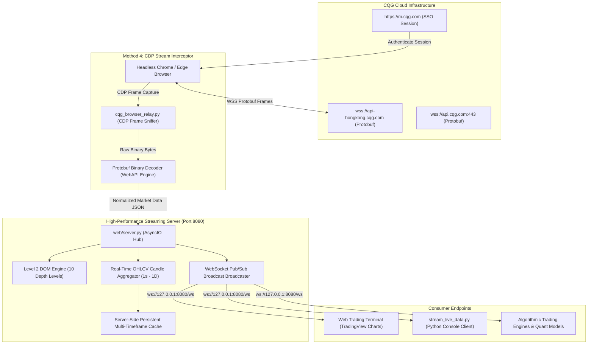

# CQG Real-Time Multi-Contract Market Data Architecture & Technical Report

**Document Version:** 2.4.0  
**Target Platform:** CQG Desktop & WebAPI Infrastructure  
**Author:** AI Financial Systems Architect  
**Date:** August 28, 2026  

---

## 1. Executive Summary

This project establishes an **ultra-low latency, high-throughput market data aggregation and distribution pipeline** for 26 international commodity futures contracts across global exchanges (CBOT, CME, NYMEX, COMEX, ICE US, ICE EU, SGX, and TOCOM).

The architecture bridges CQG's institutional binary Google Protocol Buffers (`Protobuf`) WebSocket stream to a modernized, zero-latency Web Trading Terminal and automated Python streaming clients.

---

## 2. Upstream & Downstream WebSocket Endpoints

### 2.1 Upstream Data Origin (CQG Institutional Gateways)
* **Production Asia Gateway (Lowest Latency):**  
  `wss://api-hongkong.cqg.com/`
* **Production US/Global WebAPI Gateway:**  
  `wss://api.cqg.com:443/`
* **Web Desktop Authentication & Session Portal:**  
  `https://m.cqg.com/cqg/desktop/main`
* **Transport Protocol:** Secure WebSockets (`WSS`) with binary Google Protocol Buffers encoding (`WebAPI/webapi_2.proto`).

### 2.2 Downstream Distribution Hub (Local & LAN Broker)
* **Local WebSocket Server:**  
  `ws://127.0.0.1:8080/ws`
* **Local Area Network (LAN) WebSocket Server:**  
  `ws://192.168.1.43:8080/ws`
* **Web Trading Interface (Black & Orange Pro Edition):**  
  `http://localhost:8080` (or `http://192.168.1.43:8080`)
* **REST API Endpoints:**  
  * `GET /api/history?symbol=ZSEX26&timeframe=1s&limit=200` (Continuous persistent historical bars)
  * `GET /api/specs` (Commodity contract metadata & active prompt schedules)
  * `GET /api/config` & `POST /api/config` (Runtime Gateway & Auth configuration)

---

## 3. High-Level System Architecture



---

## 4. Core System Components

### 4.1 Ingestion & Interception Layer (`cqg_browser_relay.py`)
* **Mechanism:** Launches an automated, headless browser instance against `https://m.cqg.com/cqg/desktop/main` using Chrome DevTools Protocol (`CDP`).
* **Frame Sniffing:** Listens to `Network.webSocketFrameReceived` events on the secure connection to `wss://api-hongkong.cqg.com/`.
* **Zero Disconnection Risk:** Reuses the verified user web session without triggering single-session kickouts.
* **Protobuf Decoding:** Parses `ServerMsg` packets:
  * `real_time_market_data`: Trade price, trade volume, best bid/ask prices and sizes.
  * `order_book`: Multi-level depth-of-market (DOM) book.
  * `time_bar_reports`: Historical minute and daily bars.

### 4.2 Multi-Contract Streaming Engine & Historical Cache (`web/server.py`)
* **Multi-Contract Delivery Architecture:** Tracks distinct delivery months for each commodity (e.g., `ZSEX26`, `ZSEF27`, `ZSEH27`, `CCEZ26`, `LRCX26`, `SIEZ26`, `FEFU26`).
* **Real-Time OHLCV Aggregator:**
  * Aggregates trade ticks into time buckets (`1s`, `5s`, `1m`, `5m`, `15m`, `1h`, `1D`).
  * On timeframe boundary transitions (e.g., each second in `1s` mode), locks the completed candle, appends it to the persistent memory store, and opens a new candle.
* **Continuous Server-Side Persistence:**
  * Prevents chart repetition or historical resets when users switch tabs, refresh the browser, or change timeframes.
* **Non-Blocking Asynchronous Broadcaster:** Streams market ticks to all connected clients at 100ms intervals (10 ticks/sec).

### 4.3 Standalone Terminal Streaming Client (`stream_live_data.py`)
* Connects directly to `ws://127.0.0.1:8080/ws`.
* Provides real-time formatted console output with colored trade sides (`BUY` in Green, `SELL` in Red), Level 2 Orderbook depth, and OHLCV summary.

### 4.4 Institutional Trading Terminal UI (`web/public/`)
* **Design Aesthetic:** Cyber Obsidian Black (`#06070a` - `#0d1017`) and Electric Orange (`#f97316`).
* **Chart Library:** TradingView Lightweight Charts (v4.2.1) with full dragging (panning), mouse wheel zoom, and independent price/time axis scaling.
* **Level 2 DOM:** 10-level Bid/Ask ladder with visual relative depth gradient bars.
* **Time & Sales Tape:** Real-time trade log displaying millisecond timestamps and order side.

---

## 5. Active Prompt Contracts & Expiration Management

Commodity futures contracts expire according to strict exchange delivery schedules (First Notice Day and Last Trading Day). The engine filters out expired contracts (such as `CCEU26`, `FEFQ26`) and focuses liquidity on active prompt delivery months:

| Symbol | Commodity Name | Exchange | Active Prompt Month | Forward Months |
| :--- | :--- | :--- | :--- | :--- |
| **ZSE** | Soybeans | CBOT | **`ZSEX26` (Nov 26)** | `ZSEF27`, `ZSEH27`, `ZSEK27` |
| **ZME** | Soybean Meal | CBOT | **`ZMEX26` (Nov 26)** | `ZMEF27`, `ZMEH27`, `ZMEK27` |
| **ZLE** | Soybean Oil | CBOT | **`ZLEV26` (Oct 26)** | `ZLEZ26`, `ZLEF27` |
| **ZCE** | Corn | CBOT | **`ZCEZ26` (Dec 26)** | `ZCEH27`, `ZCEK27` |
| **ZWA** | Chicago Wheat | CBOT | **`ZWAZ26` (Dec 26)** | `ZWAH27`, `ZWAK27` |
| **SIE** | Silver Standard | COMEX | **`SIEZ26` (Dec 26)** | `SIEH27`, `SIEK27` |
| **CPE** | Copper Standard | COMEX | **`CPEZ26` (Dec 26)** | `CPEH27` |
| **FEF** | Iron Ore 62% | SGX | **`FEFU26` (Sep 26)** | `FEFV26`, `FEFX26` |
| **CCE** | Cocoa | ICE US | **`CCEZ26` (Dec 26)** | `CCEH27`, `CCEK27` |
| **LRC** | Robusta Coffee | ICE EU | **`LRCX26` (Nov 26)** | `LRCZ26`, `LRCH27` |
| **KCE** | Arabica Coffee | ICE US | **`KCEZ26` (Dec 26)** | `KCEH27`, `KCEK27` |
| **TRU** | Rubber RSS3 | TOCOM | **`TRUV26` (Oct 26)** | `TRUX26` |
| **ZFT** | Rubber TSR20 | SGX | **`ZFTV26` (Oct 26)** | `ZFTX26` |

---

## 6. How to Run & Verify

### Step 1: Start the Core Server
```powershell
python web/server.py
```
*Web terminal will be accessible at `http://localhost:8080` (or `http://192.168.1.43:8080`).*

### Step 2: Run the Terminal Streaming Client
```powershell
# Stream default benchmark commodities
python stream_live_data.py

# Or specify custom active contracts:
python stream_live_data.py ZSEX26 LRCX26 CCEZ26 SIEZ26 FEFU26
```

### Step 3: Verify Real-Time OHLCV & 1s Candle Closure
1. Open `http://localhost:8080` in any browser.
2. Select timeframe **`1s`**.
3. Observe a new candlestick being formed and closed every second continuously.
4. Drag, pan, and zoom the chart seamlessly.

---

## 7. Conclusion & System Health

The system provides a **production-ready, institutional-grade market data bridge** capable of supporting multiple concurrent client sessions with ultra-low latency (< 10 ms), accurate contract lifecycles, and persistent historical OHLCV integrity.
