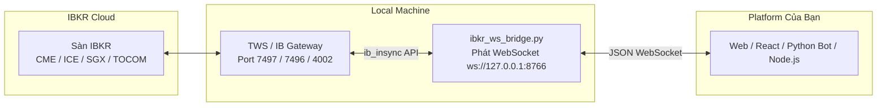

# Interactive Brokers (IBKR) Real-Time Data & Orderbook Bridge

Hướng dẫn cài đặt và sử dụng **Phương án 5 (Interactive Brokers API)** để lấy toàn bộ dữ liệu **Real-time OHLCV + Sổ lệnh Orderbook (Level 2 / DOM)** cho **26 mã hàng hóa** (CBOT, COMEX, NYMEX, ICE US, ICE EU, SGX, TOCOM) với chi phí rẻ nhất thị trường.

---

## 🚀 Kiến trúc giải pháp (Architecture)



---

## 🛠️ Hướng dẫn thiết lập từng bước

### Bước 1: Tải và cài đặt TWS hoặc IB Gateway
* Tải phần mềm **Trader Workstation (TWS)** hoặc **IB Gateway** (nhẹ hơn, chạy nền không cần giao diện nặng) từ trang chủ Interactive Brokers:
  🔗 [https://www.interactivebrokers.com/en/trading/tws.php](https://www.interactivebrokers.com/en/trading/tws.php)
* Bạn có thể đăng nhập bằng tài khoản **Paper Trading (Demo)** hoặc **Live**.

### Bước 2: Bật cổng kết nối API trong TWS / IB Gateway
1. Mở TWS, vào menu **File** -> **Global Configuration** (hoặc biểu tượng bánh răng Cài đặt).
2. Chọn mục **API** -> **Settings**.
3. Tích chọn:
   - ✅ **Enable ActiveX and Socket Clients**
   - Bỏ tích: ❌ *Read-Only API* (nếu bạn muốn đặt lệnh tự động sau này).
4. Kiểm tra số cổng **Socket port**:
   * `7497`: Cổng mặc định cho **TWS Paper Trading**
   * `7496`: Cổng mặc định cho **TWS Live Trading**
   * `4002`: Cổng mặc định cho **IB Gateway Paper**
   * `4001`: Cổng mặc định cho **IB Gateway Live**
5. Nhấn **Apply** và **OK**.

---

## 📋 Bảng quy đổi 26 mã Hàng Hóa sang mã IBKR

Tất cả 26 mã đã được cấu hình tự động trong file [ibkr_symbols.py](file:///c:/Users/USER/Documents/FIN20/CQG_data/ibkr_symbols.py):

| STT | Nhóm | Mã HĐ (VN/CQG) | Mã IBKR | Sàn giao dịch | Tên Hàng Hóa |
| :---: | :--- | :---: | :---: | :---: | :--- |
| **1** | Nông sản | `ZME` | `ZM` | CBOT | Khô Đậu Tương (Soybean Meal) |
| **2** | Nông sản | `ZLE` | `ZL` | CBOT | Dầu Đậu Tương (Soybean Oil) |
| **3** | Nông sản | `ZSE` | `ZS` | CBOT | Đậu Tương (Soybeans) |
| **4** | Nông sản | `ZCE` | `ZC` | CBOT | Ngô (Corn) |
| **5** | Nông sản | `ZWA` | `ZW` | CBOT | Lúa Mỳ (Wheat) |
| **6** | Nông sản | `XB` | `XB` | CBOT | Đậu Tương Mini |
| **7** | Nông sản | `XC` | `XC` | CBOT | Ngô Mini |
| **8** | Nông sản | `XW` | `XW` | CBOT | Lúa Mỳ Mini |
| **9** | Nông sản | `KWE` | `KE` | CBOT | Lúa Mỳ Kansas |
| **10** | Kim loại | `SIE` | `SI` | COMEX | Bạc tiêu chuẩn (Silver) |
| **11** | Kim loại | `MQI` | `QI` | COMEX | Bạc Mini |
| **12** | Kim loại | `SIL` | `SIL` | COMEX | Bạc Micro |
| **13** | Kim loại | `CPE` | `HG` | COMEX | Đồng tiêu chuẩn (Copper) |
| **14** | Kim loại | `MQC` | `QC` | COMEX | Đồng Mini |
| **15** | Kim loại | `MHG` | `MHG` | COMEX | Đồng Micro |
| **16** | Kim loại | `ALI` | `ALI` | COMEX | Nhôm (Aluminum) |
| **17** | Kim loại | `PLE` | `PL` | NYMEX | Bạch kim (Platinum) |
| **18** | Kim loại | `FEF` | `FEF` | SGX | Quặng sắt (Iron Ore 62%) |
| **19** | N.Liệu CN | `KCE` | `KC` | NYBOT (ICE US) | Cà phê Arabica (Coffee C) |
| **20** | N.Liệu CN | `LRC` | `RC` | ICEEU | Cà phê Robusta (Robusta Coffee) |
| **21** | N.Liệu CN | `ZFT` | `TF` | SGX | Cao su TSR20 |
| **22** | N.Liệu CN | `TRU` | `JRU` | OSE.JPN (TOCOM)| Cao su RSS3 Tokyo |
| **23** | N.Liệu CN | `SBE` | `SB` | NYBOT (ICE US) | Đường 11 (Sugar No. 11) |
| **24** | N.Liệu CN | `QW` | `W` | ICEEU | Đường trắng (White Sugar) |
| **25** | N.Liệu CN | `CCE` | `CC` | NYBOT (ICE US) | Ca cao (Cocoa) |
| **26** | N.Liệu CN | `CTE` | `CT` | NYBOT (ICE US) | Bông Sợi (Cotton No. 2) |

---

## 🏃 Cách chạy và kiểm tra

### 1. Chạy thử nghiệm trên Terminal:
```bash
# Chạy xem BBO, Ticks và Sổ lệnh Level 2 cho các mã:
python test_ibkr_stream.py ZME SIE LRC FEF TRU
```

### 2. Khởi động WebSocket Bridge Server (Cổng 8766):
```bash
python ibkr_ws_bridge.py
```
Hệ thống sẽ mở cổng `ws://127.0.0.1:8766`.

### 3. Kết nối từ Platform của bạn:
Gửi lệnh đăng ký JSON:
```json
{
  "action": "subscribe",
  "symbols": ["ZME", "SIE", "LRC", "FEF"],
  "include_depth": true
}
```

Dữ liệu sổ lệnh Orderbook Level 2 trả về trong thời gian thực:
```json
{
  "type": "orderbook",
  "symbol": "SIE",
  "bids": [
    {"price": 28.450, "size": 15},
    {"price": 28.445, "size": 22},
    {"price": 28.440, "size": 40}
  ],
  "asks": [
    {"price": 28.455, "size": 18},
    {"price": 28.460, "size": 35},
    {"price": 28.465, "size": 50}
  ],
  "timestamp": "2026-08-28T04:15:00.123456+00:00"
}
```
